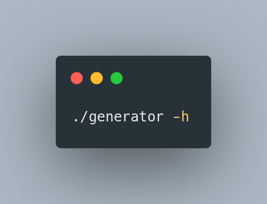
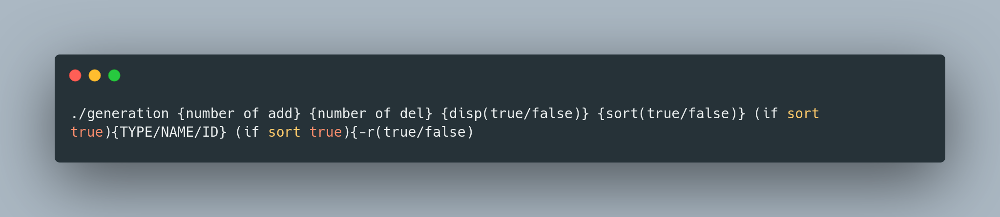
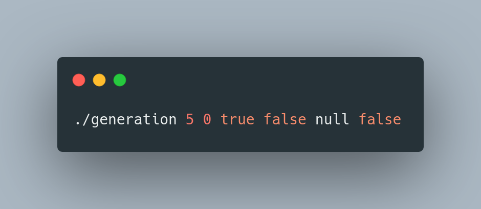
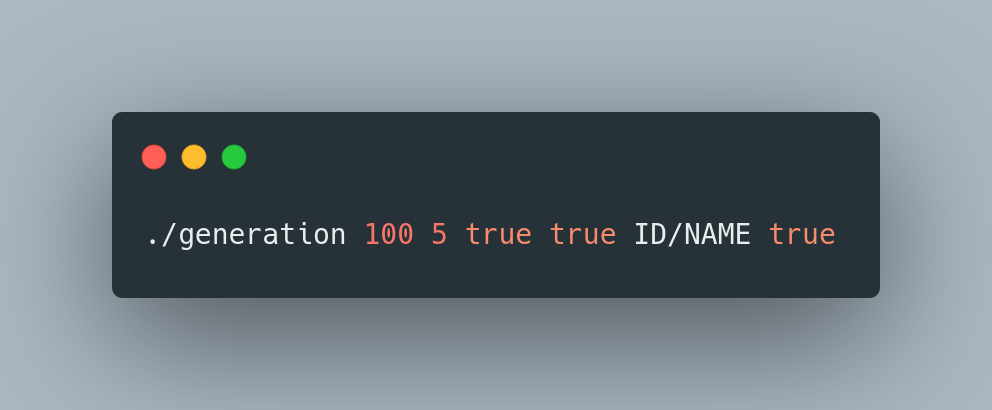
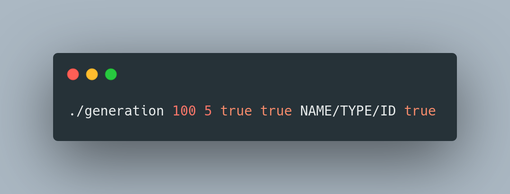
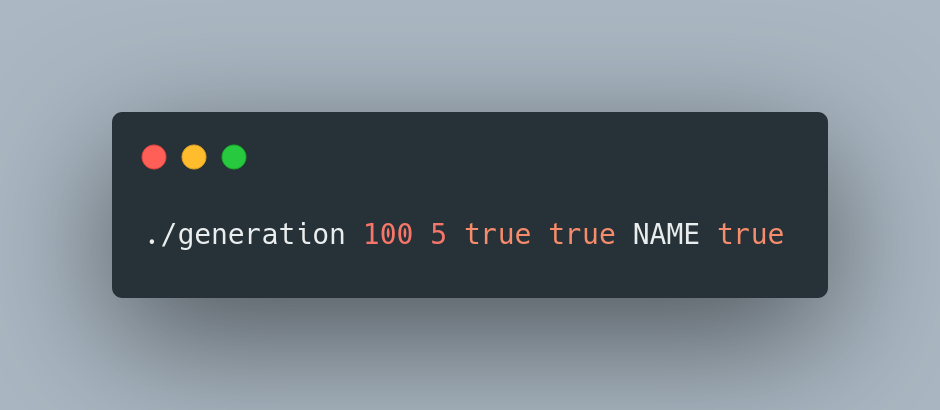

<!-- ABOUT THE PROJECT -->
## About The Project

This project involves creating a file to test the organized project. It allows you to create a large number of objects to be added quickly, as well as to delete, display or sort as you wish.

<!-- GETTING STARTED -->
## Getting Started

This is an example of how you may give instructions on setting up your project locally.
To get a local copy up and running follow these simple example steps.

### Prerequisites

Check that you have installed perl 
  ```perl -v```

### Installation

If you don't have perl you can install it [https://www.perl.org/get.html](here)

<!-- USAGE EXAMPLES -->
## Usage

The way the program is run is a little trivial and can easily lead to errors, so here are a few examples









<!-- ROADMAP -->
## Roadmap

- [x] Base features (adding/delete/display)
- [x] Multiple sort
- [ ] Sort with -r
    - [x] Basic -r
    - [ ] Several sorts with or without -r
- [ ] Add or delete when you want in the file

<!-- CONTACT -->
## Contact

Grégor Sternat - .boubou_ - gregor.sternat@epitech.eu

Project Link: [https://github.com/gregorsternat/generator-organized](https://github.com/gregorsternat/generator-organized)
